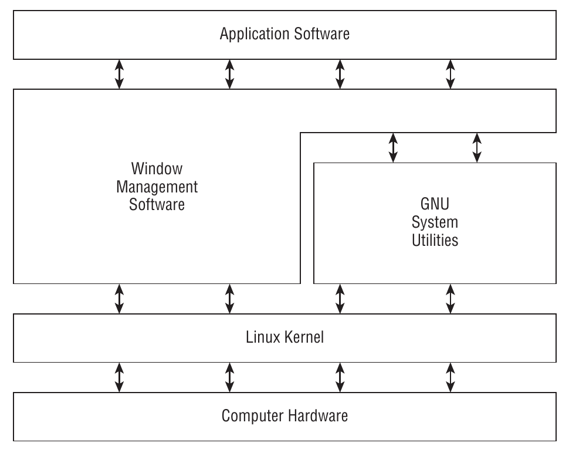
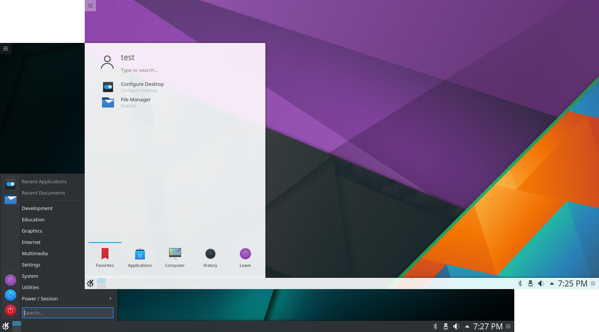
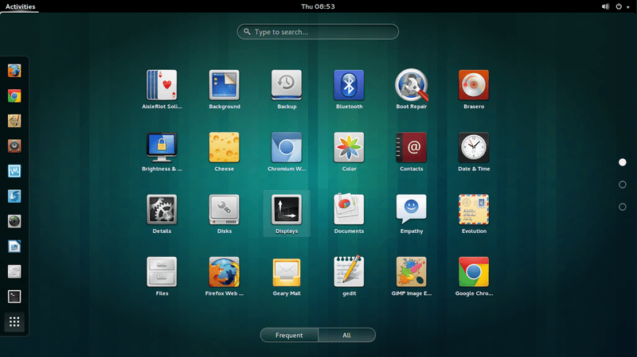
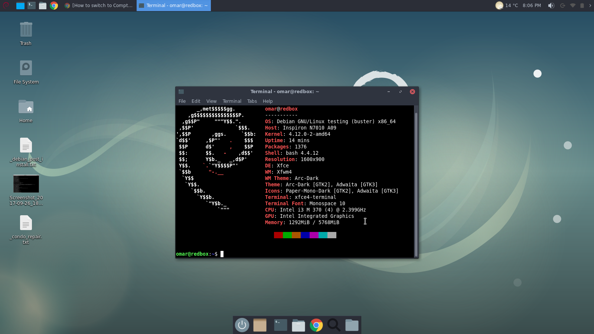
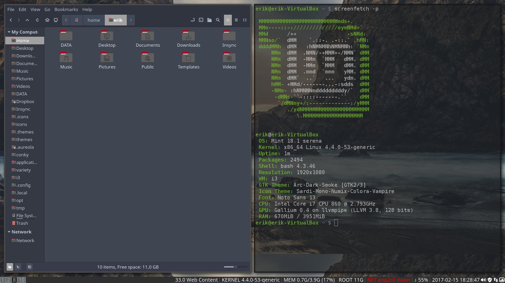

class: center, middle

# Linux concepts

---

# What is Linux?

Four main parts make up a Linux system:

- The **Linux kernel**
- The **GNU utilities**
- Graphical **desktop environment**
- Applications software

No part is very useful by itself. Each has a specific job in a Linux system.

---

# What is Linux?

.center[]

---

# The Linux kernel

The core of Linux systems is the *kernel*

It controls all the hardware and software on the computer system

The four main functions:

- System memory management
- Software management
- Hardware management
- Filesystem management

---

# The Linux kernel
## Memory management

The *kernel* is responsible to manage the physical memory

Memory locations are grouped in blocks: *pages*

The *kernel* creates and manages the virtual memory (physical memory + *swap*)

It maintains a table of memory pages that indicates which pages are in physical memory and which are *swapped* to disk

It is the *kernel*'s responsability to *swap* *pages* from disk to physical memory and vice versa

The *kernel* must allocate memory for each *process*

---

# The Linux kernel
## Software program management

A *process* is a running program. It can run:
- In the background, behind the scenes, without user interaction
- In the foreground, displaying output on a display

On boot, the *kernel* creates a process: the *init* process. It will start all other processes on the system

Linux utilizes *run levels*. They tell `init` to run only certain types of processes.
- **Level 1:** Only basic system processes are started, along one console terminal process. Used for emergency maintenance.
- **Level 3:** Runs most application software, enables network
- **Level 5:** Starts the graphical desktop window manager

---

# The Linux kernel
## Hardware management

A *device driver* or *driver* is a piece of code required by the *kernel* to communicate with hardware devices. It acts as middle man between applications and hardware.

Two ways for inserting *driver* code in Linux *kernel*:
- Drivers compiled in the *kernel*
- Driver modules which are loaded and added to the *kernel*

The second is the most common practice by users, as allows to insert *drivers* code into a running *kernel* without recompiling it.

---

# The Linux kernel
## Filesystem management

A *filesystem* controls how data is stored, for example, in a disk.

How to tell if a block of data is a image? Where does the image start and end? How to add metadata such a filename, content-type, length? How to manage space? That's up to the filesystem to specify.

Linux *kernel* supports a wide range of filesystems. It has it's own: Linux Extended Filesystem (*ext*). There's a fourth version, *ext4*.

It supports others such *ntfs*, *fat32*, *minix*, etc.

---

# The GNU Utilities

The Linux is "just" the *kernel*. An operating system needs utilities to perform standard fuctions: controlling files and programs, and other tasks.

The GNU organization developed a set of Unix utilities (in a open source software philosophy).

A Linux operating system bundles the Linux *kernel* and the GNU utilities. This is why sometimes are refered as the GNU/Linux.

The core GNU package contains:
- Utilities for handling files
- Utilities for manipulating text
- Utilities for managing processes

---

# The GNU Utilities
## The shell

A shell is an interface for accessing operating system services. It can be a CLI (command-line interface) or GUI (graphical user interface).

The shell provides built-in support for simple tasks: managing files, starting programs, etc.

A CLI shell let's you enter text commands, which are then interpreted, and result in calls to the *kernel* through the *kernel API*. Thus, the shell hides and manages technical aspects of the *kernel*.

Another important feature provided by most shells is **shell scripting**. A shell might define a language that anyone can use to write programs to be interpreted by the shell, and resulting in commands execution.

---

# Desktop environment
## Windowing systems

Your video enviroment is controlled by the video card in the computer and the monitor. In order to display fancy graphics, the operating system needs to know how to talk to both of them.

Windowing systems are responsable for presenting graphics. They are low-level programs that work directly with the video card and and monitor.

## Examples
Popular window systems: **X Window Sytem (X11)**, **Wayland**

---
class: split-50

# Desktop environment
## Examples

.column[
- KDE .de[]
- Gnome .de[]
]
.columnl[
- XFCE .de[]
- i3 .de[]
]

---

# Linux distributions

We have seen the four main components for a Linux-based operating system. Combining these components creates a complete Linux system - **distribution**.

Because components are individual and some of them are widely available, there are a lot of possible combinations, therefore there are many distributions out there.

---

# Linux distributions
## Core Linux Distributions

A core Linux distribution contains:
- *kernel*
- a graphical desktop environment

Examples:
- Red Hat
- Fedora
- Debian
- openSUSE

---

# Linux distributions
## Specialized Linux Distributions

Based on *Core* distributions, contain a subset of applications that would target more specific audiences (home users, developers, etc.).

In addition, they attempt to be more begginer-friendly, autodetect and autoconfigure hardware devices, etc.

Examples:
- Ubuntu
- Manjaro
- Mint

---

# The Manual

Most Linux distributions include a manual for looking up information on shell commands, GNU utilities, Linux API, C libraries and functions, etc.

```bash
$man
```

If you want to know what `cat` command is and what options it has, you can view the manual.

```bash
$man cat
```

---

# The Manual
## Page's sections

The manual **page** divides information into **separate sections**. Each section has a conventional naming standard.

| Section | Description |
| ------- | ----------- |
| Name | Command name and short description |
| Synopsis | Command syntax |
| Description | Describes the command generally |
| Options | The command option(s) |
| Exit Status | The command exit status indicator(s) |

**Many sections are not listed** in the table above, but the idea is that **information is consistently displayed**, so that you can easily reach the information you need.

---

# The Manual

In addition well structured pages, the manual is organized in **page section areas**

| Section Number | Area contents |
| -------------- | ------------- |
| 1 | Executable programs or shell commands |
| 2 | System calls |
| 3 | Library calls |
| 4 | Special files |
| 5 | File formats and conventions |
| 6 | Games |
| 7 | Overviews, conventions and miscellaneous |
| 8 | Super user and system administration commands |
| 9 | Kernel routines |

You don't need to remember this table! See the **description** of manual for the manual...

```bash
$man man
```

---

# The manual
## Tips

### Specific section pages

The `man` utility provides the lowest numbered section for the searched command. This is, if the same command matches entries in different sections, only the first is shown. You can tell the desired section.

```bash
$man 3 printf # show the printf page from section 3 (C library calls)
```

### Lookup for manual pages

The `-f` option allows `man` to display all manual pages that match the name in the input

```bash
$man -f printf
```

```bash
printf (1)           - format and print data
printf (1p)          - write formatted output
printf (3)           - formatted output conversion
printf (3p)          - print formatted output
```

---

# The manual
## Tips

### Searching

Sometimes you forget the exact name for a command. No problem! You can tell `man` to search and list manual pages that match your input (regular expression)

```bash
$man -k printf
```


---

# Linux filesystem

**Windows assigns a letter to a each physical disk drive**, e.g. `C:\`. Each drive contains its own directory structure for accessing files stored on it.

**Linux does not use driver letters** in pathnames.

Linux stores files within a single directory structure, which is called *virtual directory*. This *virtual directory* has paths to all storage devices from a single directory structure.

The single directory base is called **root**. This is the one directory from which all other directories branch off from.

Another difference from Windows, is that Windows uses backward slashes, `\`. Linux uses forward slashes `/`.

---

The path below is an example for a file `example.txt` in the directory `Documents` which is under `ieee` directory (which is a user in this case), which is under `home` directory.

```
/home/ieee/Documents/example.txt
```

A tricky part in the Linux virtual directory is how it incorportares storage devices. There's a root drive which contains the virtual directory code, for example, the hard drive where you install the operating system.

If you plug-in removable media or you have multiple hard drives

---

# Linux filesystem
## The directories meaning

| Directory | Description |
| --------- | ----------- |
| `/bin` | Contains the binaries, i.e, some applications and programs that you can run. There are other `/bin` directories in other parts of the file system |
| `/boot` | Contains the boot files, the files required to start your system |
| `/dev` | Contains the *device files*. Recall that *device files* are interfaces for *device drivers* which let applications communicate with peripherals. These files are generated on boot and even on the fly (e.g. when you plug in a webcam) |
| `/etc` | Contains most of system configuration files |
| `/home` | Users' personal directories. For each user typically there's a file under `/home`, like `/home/ieee` |
| `/lib` | Libraries files, which contain code to be used by applications |
| `/media` | This is where external storage is automatically mounted when you plug in storage devices such pendrives, extenal hard disks, etc. |
| `/mnt` | Not often used nowadays, but this is where you would manually mount storage devices and partitions |

---

# Linux filesystem
## The directories meaning


| Directory | Description |
| --------- | ----------- |
| `/proc` | Like `/dev` is a *virtual directory* that contains information about your PC (CPU, kernel, etc.). It's generated on boot or on the fly (things may change) |
| `/root` | The home directory for the supersuser. You shouldn't thouch this folder |
| `/sys` | Another *virtual directory* which also contains informations from devices connected to the computer |
| `/tmp`| Contains temporary files |
| `/var` | Intended to be a folder containing content which changes frequently, altough the virtual directories mentioned also change frequently, thus it's not a great folder name nowadays. Nevertheless, this is where you can find system and application logs |

---

# Linux filesystem
## Traversing directories

To change the current directory use `cd` command:

```bash
$cd <destination>
```

Two kinds of directory references:
- **Absolute** path: Defines exactly where the directory, starting at the root, thus always starts with forward slashes
- **Relative** path: You specify a path relative to your current directory (I am at directory `A`, how can I go to directory `B`?)

Two special characters for relative directories:
- Single dot `.` : symbolic name for the current directory
- Double dot `..` : symbolic name for the parent directory (previous)
	
```bash
$cd /home/ieee/Documents/
```

---

# Linux filesystem
## Examples with relative paths

```
.parent
├── current
│   └── child
└── dummy
```

Assume **you are in the `current` directory.**

In order to go to the upper level, `parent` directory:

```
$pwd # /.../parent/current
$cd ..
$pwd # /.../parent
```

**Tip** : Use `pwd` to know your current absolute path

---

# Linux filesystem
## Examples with relative paths

Or to go from `current` to `dummy`, which are at the same level:

```
$cd ../dummy/ # first we go to parent (..), then we change to dummy/
```

If we are at `current` and we wish to navigate to subfolders like `child`, we can use the relative path:

```
$cd child
```

---

# Linux filesystem
## Listing files and directories

Use ls to list files and directories located in your current directory

The list is apalhabetical order and displayed in rows. If your terminal supports colors, different types of entries (files, folders, executables, links, ...) are shown in distinct colors for easier reading.

In addition to colors you can use the `-F` option. Entries with `/` are folders, executables have a `*` at the end, and so on.

---

# Linux filesystem
## Listing files and directories

Some files in Linux are **hidden files**. Their name starts with a dot (`.bashrc`). By default they are not shown by `ls`. If you want to see them, use the `-a` or `--all` option.

```
$ls -a
```

Use `-R` for recursive listing. By default, `ls` only lists entries which are direct child of the current directory. If you want to list entries from subfolders, you must use this option.

```
$ls -R
```

---

# Linux filesystem
## Listing files and directories

Default list doesn't tells us much, it's just a quick overview of the current directory content. If you wish to view more datails use the long listing option, `-l`.

```
$ls -l
```

It shows file permissions, size, modification time, etc. The very first character tells you the type of file:

| Character | Description |
| --------- | ----------- |
| `d` | Directory |
| `-` | File |
| `l` | Linked file |
| `c` | Character device |
| `b` | Block device |

???

A parte dos devices tem haver com device files

---

# Linux filesystem
## Listing files and directories

**Tip**: You can mix options parameters like `ls -l -a -R`. Moreover, you don't need to type them separately, you can use `ls -laR`.

// TODO: talk about wildcards?

---

# Linux filesystem
## Creating files

You can create empty files with `touch`

```bash
$touch <filename>
$touch main.c # empty file called main.c
```

You can also use `touch` to create files with specific modification times or change existing files modification times.

---

# Linux filesystem
## Copying files

To copy files and folders from one destination to another, you use `cp`.

```bash
$cp <source> <destination>
```

```bash
$cp filename.txt dst/
```

If the `source` is a file and destination is a folder, the file is copied to that folder. The example above copies the file `filename.txt` to the folder `dst`.

---

# Linux filesystem
## Copying files

What if the folder `dst/` has a file named `filename.txt`? By default, the file would be overwritten silently. If you use the `-i` option, the utility will prompt and ask you if you want to overwrite. If you want, just type `y`.

```bash
$cp -i filename.txt dst/
cp: overwrite 'dst/filename.txt'?
```

**Note:** Most modern Linux distributions create an alias and when you run `cp` you are actually running `cp -i`.

---

# Linux filesystem
## Copying files

**Tip**: In the previous example the directory name was followed by a forward slash, `/`. You only need to do it if there's ambiguity, i.e., there's a filename and a folder with the same name.
